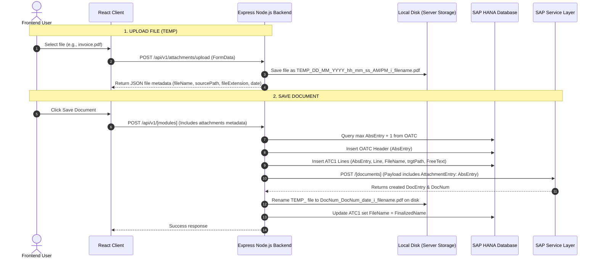
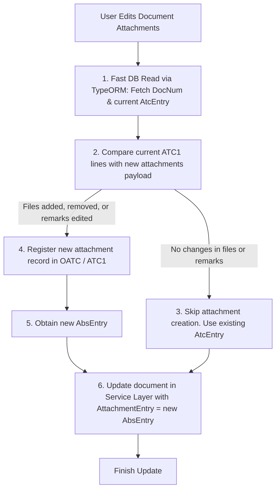

# Vendor Portal Attachment Architecture

This reference explains how document attachments are uploaded, stored, synchronized, and copied between modules in the Vendor Portal and SAP B1.

---

## 1. High-Level Data Flow (Visually Simple)

The diagram below outlines the full lifecycle of an attachment from frontend file upload to backend disk storage and SAP database linkage.



---

## 2. Local Storage Folder & File Naming Structure

Attachments are stored on the server's disk using the path configured in `ATTACHMENTS_BASE_PATH` (e.g. `C:\SAP_Shared\Attachments`).

```
[ATTACHMENTS_BASE_PATH] (Root Folder)
  ├── [Company_DB_1]
  │     ├── PurchaseQuotation
  │     │     └── 2026-06-25 (Date-based subfolder)
  │     │           ├── TEMP_25_06_2026_01_40_12_PM_0_invoice.pdf     <-- Temporarily Uploaded
  │     │           └── DocNum_10023_25_06_2026_01_40_20_PM_0_invoice.pdf <-- Finalized after document save
  │     ├── PurchaseOrder
  │     └── GRPO
  └── [Company_DB_2]
```

### Temporary vs. Finalized Name Transition
1. **On Upload (Temp State):**
   `TEMP_<DD_MM_YYYY_hh_mm_ss_AM/PM>_<Index>_<SanitizedOriginalName>.<Extension>`
   *Example:* `TEMP_25_06_2026_01_40_12_PM_0_invoice.pdf`
2. **On Document Save (Finalized State):**
   `DocNum_<DocNum>_<DD_MM_YYYY_hh_mm_ss_AM/PM>_<Index>_<SanitizedOriginalName>.<Extension>`
   *Example:* `DocNum_10023_25_06_2026_01_40_20_PM_0_invoice.pdf`

---

## 3. Database Schemas & Table Columns

The synchronization uses **two SAP system tables** for attachment metadata, and **one column** in each main document header table.

### A. Attachment Header Table (`OATC`)
Holds the unique attachment entry identifier.

| DB Column Name | TypeScript Field | Type | Description |
| :--- | :--- | :--- | :--- |
| **`AbsEntry`** (PK) | `absEntry` | `int` | Primary Key. The unique identifier generated sequentially by taking `MAX(AbsEntry) + 1` from the database. |

### B. Attachment Lines Table (`ATC1`)
Holds the individual file metadata records for each attachment entry.

| DB Column Name | TypeScript Field | Type | Description |
| :--- | :--- | :--- | :--- |
| **`AbsEntry`** (PK, FK) | `absEntry` | `int` | Maps back to `OATC.AbsEntry`. |
| **`Line`** (PK) | `line` | `int` | Line number index (starts at 1). |
| **`trgtPath`** | `trgtPath` | `nvarchar(260)` | The folder path where the file is stored on the server's disk. |
| **`FileName`** | `fileName` | `nvarchar(260)` | File name without extension (e.g., `DocNum_10023_25_06_2026_01_40_20_PM_0_invoice`). |
| **`FileExt`** | `fileExt` | `nvarchar(20)` | File extension (e.g., `pdf`, `png`, `xlsx`). |
| **`FreeText`** | `freeText` | `nvarchar(254)` | **Stores the file's Notes / Remarks** entered by the user. |
| **`Date`** | `date` | `date` | Timestamp when the attachment was registered in the database. |
| **`Copied`** | `copied` | `nvarchar(1)` | Internal SAP flag (always set to `'Y'`). |

### C. Document Header Tables (e.g., `OPQT`, `OPOR`, `OPDN`, etc.)
Each document references its attachments via a single column.

| DB Column Name | TypeScript Field | Type | Description |
| :--- | :--- | :--- | :--- |
| **`AtcEntry`** | `atcEntry` | `int` (Nullable) | Points directly to the `AbsEntry` in the `OATC` table. If `NULL`, the document has no attachments. |

---

## 4. Document Update & Sync Lifecycle (EDIT)

When an existing document is updated:



> [!NOTE]
> Creating a new `AbsEntry` for attachment updates ensures database consistency, prevents overwriting shared attachment history, and matches SAP's native versioning behavior.

---

## 5. "Copy-To" & "Copy-From" Workflow

When copying a source document (e.g., Purchase Quotation #105) to a target document (e.g., Purchase Order #450):

```
[Source PQ (DocNum: 105)]
  └── AtcEntry = 501 (Points to OATC/ATC1 record 501)
        │
        ▼ (Copy From / Copy To action)
[Frontend Form (PO Create Page)]
  └── Receives source attachments array:
      [ { fileName: "DocNum_105_invoice", sourcePath: "C:\Attachments", ... } ]
        │
        ▼ (User clicks Save on Target PO)
[Node Backend POST /api/v1/purchase-orders]
  ├── Step A: createSAPAttachment() clones metadata records into a NEW OATC & ATC1
  │   - Re-registers files from their existing sourcePath
  │   - Generates brand new AbsEntry = 502
  └── Step B: POST PO to Service Layer with AttachmentEntry = 502
        │
        ▼
[Target PO (DocNum: 450)]
  └── AtcEntry = 502 (Completely independent of source PQ!)
```

### Key Rules of Copying:
1. **No Duplicate Files on Disk:** The physical files are not duplicated on disk during the copy process. The new `ATC1` records point to the exact same `trgtPath` and `FileName` as the source document files.
2. **Complete Metadata Independence:** Because the target document receives a brand-new `AtcEntry` (e.g. `502` instead of `501`), **deleting or adding files to the target document (PO) later will not affect the source document (PQ)**. They are completely separate logical lists.
