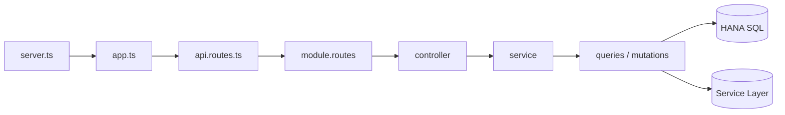

# HANA backend structure

Package: **`hana-backend/`** · default port **`4000`**

| | |
|--|--|
| Read | SAP HANA (company DBs + common registry) |
| Write docs | **SAP Service Layer** |
| Driver | TypeORM schemas + `hana.service` + SL client |
| Multi-tenant | `companyDB` + SL session on Express session |

Related: `Docs/backend-structure-sql.md` · `Docs/login-architecture.md` · `Docs/observability.md`

---

## 1) Folder map

```text
hana-backend/src/
├── server.ts              boot: HANA pool + TypeORM + SL → listen
├── app.ts                 Express: middleware → routes → errors
├── config/                env, middleware, session, swagger, zod
├── core/
│   ├── errors/            AppError + error-handler
│   ├── logger/            pino + ALS requestId
│   ├── middleware/        auth, validation, rate-limit, request-logger
│   ├── observability/     metrics + traces
│   └── utils/             cache, cookie-parser, doc-status
├── db/
│   ├── config/
│   │   ├── data-source.ts           common registry (ORGANIZATION)
│   │   └── tenant-data-source.ts    per-company TypeORM
│   ├── schemas/*.schema.ts          SAP tables (OPOR, OUSR, …)
│   └── tenant-query.ts              getTenantRepository(dbName, Schema)
├── modules/               ★ features (auth, purchase-order, …)
├── routes/
│   ├── api.routes.ts      /api/v1 mounts
│   └── health.routes.ts
├── services/
│   ├── hana.service.ts              raw HANA pool
│   ├── service-layer.service.ts     B1 session map
│   ├── service-layer-request.ts     login / request / refresh
│   ├── credential.service.ts        org SL user/pass
│   ├── export/  dashboard/  …
│   └── types/
├── shared/route-handlers/
├── types/
└── validation/schemas/env.schema.ts
```

### Top folders

| Folder | Job |
|--------|-----|
| `server.ts` | Start HANA + TypeORM + SL; listen; shutdown |
| `app.ts` | HTTP stack |
| `config/` | Env, session, Swagger |
| `core/` | Auth gate, logs, errors, OTel |
| `db/` | TypeORM schemas + tenant helpers |
| `modules/*` | One business feature |
| `routes/` | URL tree |
| `services/` | HANA pool, SL, export, dashboard math |

---

## 2) Request path

```text
HTTP
  → app.ts  (helmet, cors, json, requestLogger, metrics, session)
  → routes/api.routes.ts  (/api/v1/…)
  → modules/<feature>/<feature>.routes.ts
  → validateSession / validateQuery|Body
  → controller
  → service
  → queries (HANA) | mutations (Service Layer)
  → JSON | error-handler
```



**Rule:** list/detail **read HANA**; create/update/cancel **write Service Layer**.

---

## 3) Module file pattern

Example: `modules/purchase-order/`

```text
purchase-order.routes.ts
purchase-order.controller.ts
purchase-order.service.ts              # facade / re-exports
purchase-order.schema.ts               # Zod + OpenAPI
purchase-order.types.ts
purchase-order.queries.ts              # barrel reads
purchase-order.list.queries.ts         # HANA SELECT list
purchase-order.detail.queries.ts       # HANA SELECT detail
purchase-order.mutations.ts            # barrel writes
purchase-order.create.mutation.ts      # SL POST
purchase-order.update-cancel.mutations.ts
```

| File | Role |
|------|------|
| `*.routes.ts` | URLs + middleware |
| `*.controller.ts` | HTTP |
| `*.service.ts` | facade |
| `*.schema.ts` | validate |
| `*.list|detail.queries.ts` | **read HANA** |
| `*.create.mutation.ts` etc. | **write SL** |

Same recipe for: auth, organization, dashboard, grpo, invoices, payments, master-data, …

---

## 4) Data / services layer

```text
src/db/
  config/data-source.ts          COMMON_DB + ORGANIZATION
  config/tenant-data-source.ts   company DB connections
  schemas/*.schema.ts            OPOR, POR1, OUSR, OCRD, …
  tenant-query.ts

src/services/
  hana.service.ts                pool.query(sql)
  service-layer.service.ts       login / request / logout
  service-layer-request.ts       axios + cookie session
  credential.service.ts          SL username/password per org
```

---

## 5) Boot

```text
core/observability/register.ts   (optional --import)
  → server.ts
      → hanaPool.initialize()
      → initializeDatabase()           # common TypeORM
      → serviceLayerClient.initialize()
      → app.listen(PORT)
```

`app.ts`: metrics → middleware → swagger → `/api/v1/health` → `/api/v1` → 404 → errorHandler

---

## 6) Login — file / folder flow

Detail: `Docs/login-architecture.md` (HANA sections).

```text
POST /api/v1/auth/login
{ username, password, companyDB }
```

```text
1  app.ts
2  routes/api.routes.ts  → /auth
3  modules/auth/auth.routes.ts
      loginLimiter + validateBody(auth.schema) + controller.login
4  modules/auth/auth.controller.ts
5  modules/auth/auth.service.ts  (parallel)
      A) services/credential.service.ts
            → db OrganizationSchema (COMMON)
            → SL user/pass, dbServer
      B) db/tenant-query + UserSchema (OUSR in companyDB)
            → USER_CODE, U_PortalPassword
6  portal password === U_PortalPassword
7  services/service-layer.service.ts → /Login (B1)
8  controller: session.regenerate
      user, dbName, sessionId, slUsername, slPassword
9  200 + Set-Cookie
```

```text
Folder walk
───────────
app.ts
 └─ routes/api.routes.ts
     └─ modules/auth/
         ├─ auth.routes.ts
         ├─ auth.schema.ts
         ├─ auth.controller.ts
         └─ auth.service.ts
              ├─ services/credential.service.ts
              │    → db/schemas/organization.schema.ts
              ├─ db/tenant-query.ts + db/schemas/user.schema.ts
              └─ services/service-layer.service.ts
                   └─ service-layer-request.ts → SAP
```

**Org dropdown (no username needed):**

```text
GET /api/v1/organizations
  → modules/organization/*
  → all ORGANIZATION rows
```

**After login:** cookie → `core/middleware/auth.middleware.ts` (`validateSession`; may refresh SL).

---

## 7) Purchase Order — full E2E

Base: `/api/v1/purchase-orders`  
Mount: `routes/api.routes.ts` → `purchaseOrderRoutes`

| Method | Path | Action |
|--------|------|--------|
| GET | `/` | list |
| GET | `/:id`, `/by-doc-num/:docNum` | detail |
| GET | `/docnums` | lookup |
| POST | `/` | create |
| PATCH | `/:id` | update |
| POST | `/:id/cancel` | cancel |
| GET | `/by-doc-num/:docNum/export/:format` | export |

### List

```text
GET /purchase-orders
  app.ts → api.routes.ts
  → purchase-order.routes.ts
       validateSession + validateQuery(schema)
       controller.getPurchaseOrders
  → controller (dbName from session)
  → service → queries → list.queries.ts
       HANA SQL (OPOR / lines)
       db/schemas/purchase-order.schema.ts
  → JSON
```

### Create

```text
POST /purchase-orders
  routes → controller
       CreatePurchaseOrderInputSchema
       sessionId + dbName
  → service → mutations → create.mutation.ts
       service-layer.service POST /PurchaseOrders | Drafts
       optional attachments
  → JSON from SAP
```

```text
Write path:  controller → service → create.mutation → SL → SAP
Read path:   controller → service → list|detail.queries → HANA
```

### Update / cancel

```text
PATCH /:id        → update-cancel.mutations.ts → SL
POST  /:id/cancel → update-cancel.mutations.ts → SL
```

### Export

```text
GET .../export/pdf
  → shared/route-handlers/create-document-export-handler.ts
  → detail query
  → services/export/*
```

### File tree (PO request)

```text
app.ts
routes/api.routes.ts
modules/purchase-order/
  purchase-order.routes.ts
  purchase-order.schema.ts
  purchase-order.controller.ts
  purchase-order.service.ts
  purchase-order.list.queries.ts      # READ  → HANA
  purchase-order.detail.queries.ts    # READ  → HANA
  purchase-order.create.mutation.ts   # WRITE → SL
  purchase-order.update-cancel.mutations.ts
services/service-layer.service.ts
services/hana.service.ts
db/schemas/purchase-order.schema.ts
core/middleware/auth.middleware.ts
core/errors/error-handler.ts
```

---

## 8) Modules (same wiring as PO)

```text
auth, organization, dashboard,
purchase-quotation, grpo, ap-invoice, ap-credit-memo, outgoing-payment,
sales-quotation, sales-order, ar-invoice, ar-credit-memo, incoming-payment,
goods-receipt, goods-issue, transfer, transfer-request,
master-data, item-master, attachments, bank-details, relationship-map
```

```text
api.routes → module.routes → controller → service → query | mutation
```

---

## 9) Middleware

| File | When |
|------|------|
| `core/middleware/request-logger.middleware.ts` | every request |
| `core/observability/http-metrics.middleware.ts` | RED metrics |
| `core/middleware/auth.middleware.ts` | protected (+ SL check) |
| `core/middleware/validation.middleware.ts` | Zod |
| `core/middleware/rate-limit.middleware.ts` | login + API |
| `core/errors/error-handler.ts` | last |

---

## 10) Mental model

```text
Frontend → hana-backend
              │
       ┌──────┴──────┐
       ▼             ▼
    HANA SQL     Service Layer
    (reads)      (writes / login)
```

**Login** = ORGANIZATION + OUSR + SL session.  
**PO** = HANA list/detail + SL create/update/cancel.
