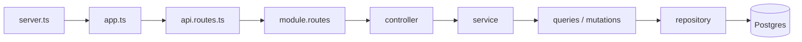

# SQL backend structure

Package: **`sql-backend/`** · default port **`4001`**

| | |
|--|--|
| Read / write | **PostgreSQL** only (no SAP Service Layer) |
| ORM | Drizzle + `pg` pools |
| Multi-tenant | `user_db_access` + tenant pool via ALS |

Related: `Docs/backend-structure-hana.md` · `Docs/login-architecture.md` · `Docs/observability.md`

---

## 1) Folder map

```text
sql-backend/src/
├── server.ts              boot: initializeDatabase → listen
├── app.ts                 Express: middleware → routes → errors
├── config/                env, cors, session, swagger, zod
├── core/
│   ├── errors/            AppError + error-handler
│   ├── logger/            pino + ALS requestId
│   ├── middleware/
│   │   ├── auth.middleware.ts
│   │   ├── tenant.middleware.ts      ★ session.dbName → tenant pool
│   │   ├── request-transformer.middleware.ts
│   │   ├── validation / rate-limit / request-logger
│   ├── observability/     metrics + traces
│   └── utils/             sap-format, series, query-helper, …
├── db/
│   ├── client.ts          registry + tenant pools + ALS
│   ├── schema/*.ts        Drizzle tables
│   ├── migrations/        SQL history
│   ├── seed/              demo data
│   ├── migrate.ts
│   └── seed.ts
├── modules/               ★ features (auth, purchase-order, …)
├── routes/
│   ├── api.routes.ts      /api/v1 mounts
│   └── health.routes.ts
├── services/
│   ├── document-link/     base docs / open qty / parent status
│   ├── export/
│   ├── dashboard/
│   ├── discount.util.ts
│   └── docnum-lookup.util.ts
├── shared/route-handlers/
├── types/
└── validation/schemas/env.schema.ts
```

### Top folders

| Folder | Job |
|--------|-----|
| `server.ts` | Start Postgres registry pool; listen; shutdown |
| `app.ts` | HTTP stack |
| `config/` | Env, session, Swagger |
| `core/` | Auth, tenant context, logs, errors, OTel |
| `db/` | Drizzle schema, migrations, seed, client |
| `modules/*` | One business feature |
| `routes/` | URL tree |
| `services/` | document-link, export, dashboard helpers |

---

## 2) Request path

```text
HTTP
  → app.ts  (helmet, cors, json, requestLogger, metrics, session)
  → routes/api.routes.ts
       public: /auth, /organizations
       then: validateSession → initTenantContext → rate limit → transformer
  → modules/<feature>/<feature>.routes.ts
  → controller
  → service
  → queries | mutations
  → repository (Drizzle)
  → getDb() tenant Postgres
  → JSON | error-handler
```



**Rule:** all reads and writes go through **repository → Postgres**.

---

## 3) Module file pattern

Example: `modules/purchase-order/`

```text
purchase-order.routes.ts
purchase-order.controller.ts
purchase-order.service.ts
purchase-order.schema.ts
purchase-order.queries.ts
purchase-order.mutations.ts
purchase-order.mutations.create.ts
purchase-order.mutations.update.ts
purchase-order.repository.ts       # all SQL
```

| File | Role |
|------|------|
| `*.routes.ts` | URLs + middleware |
| `*.controller.ts` | HTTP + often `toPascalCase*` for UI |
| `*.service.ts` | facade |
| `*.schema.ts` | Zod + OpenAPI |
| `*.queries.ts` | **read** orchestration |
| `*.mutations*.ts` | **write** orchestration |
| `*.repository.ts` | **Drizzle SQL** |

Same recipe for: auth, organization, dashboard, grpo, invoices, payments, master-data, …

---

## 4) Data layer

```text
src/db/
  client.ts
    registryPool          # users, orgs, access
    pools Map             # per tenant dbName
    getDb() / getDbForTenant()
    dbContext ALS
  schema/
    users.ts
    user-db-access.ts
    organizations.ts
    purchase-orders.ts
    purchase-order-lines.ts
    …
  migrations/
  seed/
```

```text
src/core/middleware/tenant.middleware.ts
  session.user.dbName → getDbForTenant → ALS for rest of request
```

---

## 5) Boot

```text
core/observability/register.ts   (optional --import)
  → server.ts
      → initializeDatabase()      # registry pg pool
      → app.listen(PORT)
```

`app.ts`: metrics → middleware → swagger → `/api/v1/health` → `/api/v1` → 404 → errorHandler

---

## 6) Login — file / folder flow

Detail: `Docs/login-architecture.md` (SQL sections).

```text
POST /api/v1/auth/login
{ username, password, companyDB }
```

```text
1  app.ts
2  routes/api.routes.ts  → /auth  (public)
3  modules/auth/auth.routes.ts
      loginLimiter + validateBody + controller.login
4  modules/auth/auth.controller.ts
5  modules/auth/auth.service.ts
      → auth.repository.ts
           users            password match
           user_db_access   may use companyDB?
           organizations    companyName, dbServer
6  controller: session.regenerate
      session.user = { userName, companyName, dbName, dbServer }
7  200 + Set-Cookie
```

```text
Folder walk
───────────
app.ts
 └─ routes/api.routes.ts
     └─ modules/auth/
         ├─ auth.routes.ts
         ├─ auth.schema.ts
         ├─ auth.controller.ts
         ├─ auth.service.ts
         └─ auth.repository.ts
              → db/schema/users.ts
              → db/schema/user-db-access.ts
              → db/schema/organizations.ts
```

**Org dropdown (needs username):**

```text
GET /api/v1/organizations?username=alice
  → modules/organization/*
  → no username → []
  → else users ⋈ user_db_access ⋈ organizations
```

**After login:**

```text
cookie → validateSession
      → initTenantContext (tenant.middleware)
           dbName → getDbForTenant → getDb() in modules
```

---

## 7) Purchase Order — full E2E

Base: `/api/v1/purchase-orders`  
Mount: `routes/api.routes.ts` → `purchaseOrderRoutes` (after session + tenant)

| Method | Path | Action |
|--------|------|--------|
| GET | `/` | list |
| GET | `/:id`, `/by-doc-num/:docNum` | detail |
| GET | `/docnums`, `/next-docnum` | lookup / series |
| POST | `/` | create |
| PATCH | `/:id` | update |
| POST | `/:id/cancel` | cancel |
| GET | `/by-doc-num/:docNum/export/:format` | export |

### List

```text
GET /purchase-orders
  app.ts → api.routes.ts
       validateSession + initTenantContext + transformer
  → purchase-order.routes.ts → controller.getList
  → service.getList → queries → repository
       Drizzle: purchase_orders + purchase_order_lines
       getDb() = tenant ALS
  → controller toPascalCaseList (UI shape)
  → JSON
```

### Create

```text
POST /purchase-orders
  routes → controller.create → service.create
  → mutations.create.ts
       db.transaction
       document-link validateBaseLinks
       discount.util calculateLineTotal
       master-data resolveCardName
       series.util getNextDocNum
       repository insert header + lines
  → JSON
```

```text
Write path: controller → service → mutations.create → repository → Postgres
```

### Update / cancel

```text
PATCH /:id       → mutations.update.ts → repository
POST  /:id/cancel → mutations cancel → repository status
```

### Export

```text
GET .../export/pdf
  → shared/route-handlers/create-document-export-handler.ts
  → service.getByDocNum
  → services/export/*
```

### File tree (PO request)

```text
app.ts
routes/api.routes.ts
core/middleware/auth.middleware.ts
core/middleware/tenant.middleware.ts
modules/purchase-order/
  purchase-order.routes.ts
  purchase-order.controller.ts
  purchase-order.service.ts
  purchase-order.queries.ts
  purchase-order.mutations.create.ts
  purchase-order.mutations.update.ts
  purchase-order.repository.ts
db/client.ts
db/schema/purchase-orders.ts
db/schema/purchase-order-lines.ts
services/document-link/*
services/discount.util.ts
core/utils/series.util.ts
core/utils/sap-format.util.ts
core/errors/error-handler.ts
```

---

## 8) Modules (same wiring as PO)

```text
auth, organization, dashboard,
purchase-quotation, grpo, ap-invoice, ap-credit-memo, outgoing-payment,
sales-quotation, sales-order, ar-invoice, ar-credit-memo, incoming-payment,
goods-receipt, goods-issue, transfer, transfer-request,
master-data, item-master, attachments, bank-details, relationship-map
```

```text
api.routes → module.routes → controller → service → query|mutation → repository
```

---

## 9) Middleware

| File | When |
|------|------|
| `core/middleware/request-logger.middleware.ts` | every request |
| `core/observability/http-metrics.middleware.ts` | RED metrics |
| `core/middleware/auth.middleware.ts` | protected |
| `core/middleware/tenant.middleware.ts` | **tenant DB ALS** |
| `core/middleware/request-transformer.middleware.ts` | field name map |
| `core/middleware/validation.middleware.ts` | Zod |
| `core/middleware/rate-limit.middleware.ts` | login + API |
| `core/errors/error-handler.ts` | last |

---

## 10) Mental model

```text
Frontend → sql-backend
              │
              ▼
         PostgreSQL
         (all R/W)
              │
    registry: users, orgs, access
    tenant:   purchase_orders, …
```

**Login** = users + user_db_access + organizations (no SAP).  
**PO** = repository transactions on `purchase_orders` / lines.
