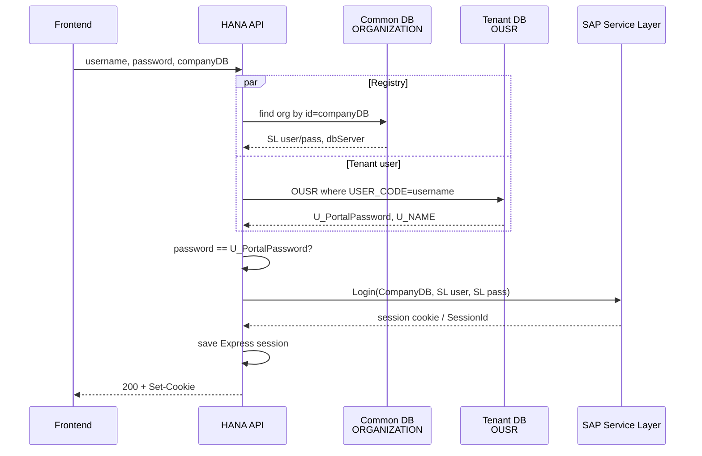
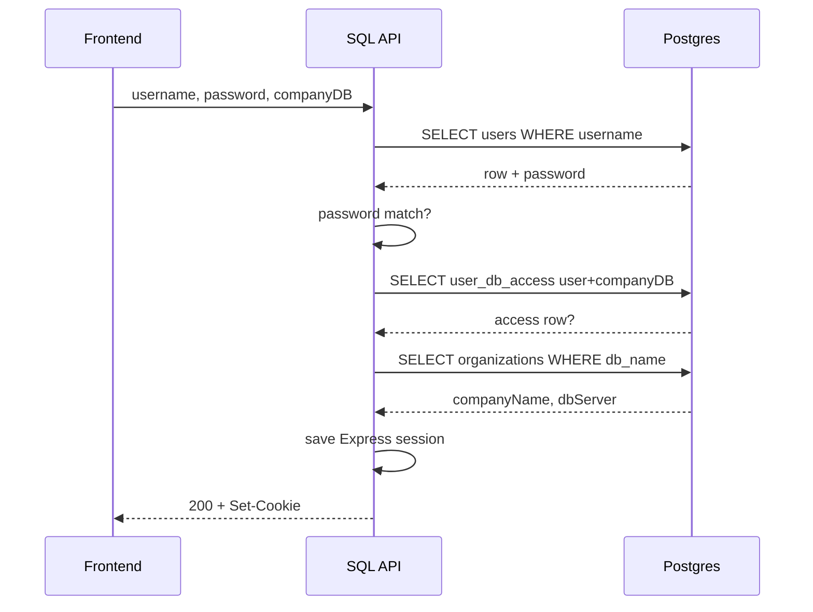

# Login architecture

Minimal map of **who checks username/password**, **which tables**, **what SAP does**.

API body (both backends):

```json
{ "username": "...", "password": "...", "companyDB": "..." }
```

`POST /api/v1/auth/login` → cookie session for browser.

---

## Big picture

```text
┌──────────┐     username + password + companyDB      ┌─────────────────┐
│ Frontend │ ───────────────────────────────────────► │ Backend (API)   │
└──────────┘                                          └────────┬────────┘
                                                               │
                    ┌──────────────────────────────────────────┼──────────────────────────┐
                    │                                          │                          │
                    ▼                                          ▼                          ▼
           ┌────────────────┐                        ┌─────────────────┐         ┌────────────────┐
           │ Registry /     │                        │ Tenant company  │         │ SAP Service    │
           │ common DB      │                        │ DB              │         │ Layer (HANA    │
           │ (org list,     │                        │ (user row)      │         │ only)          │
           │ SL creds HANA) │                        │                 │         │                │
           └────────────────┘                        └─────────────────┘         └────────────────┘
```

| | **HANA backend** | **SQL backend** |
|--|------------------|-----------------|
| User store | SAP table **OUSR** (tenant) | Postgres **users** |
| Password field | **U_PortalPassword** (portal UDF) | **users.password** |
| Company / tenant | `companyDB` = org id | `companyDB` = org `db_name` |
| Access check | user exists in that company DB | **user_db_access** row |
| SAP Service Layer | **Yes** — B1 session required | **No** |
| After success | Express session + SL cookie/session | Express session only |

---

## Why HANA shows DBs immediately, SQL only after username

Same login UI. Same list API:

```http
GET /api/v1/organizations
GET /api/v1/organizations?username=alice
```

**Backend rules differ.**

### HANA — DB list without username

HANA treats **ORGANIZATION** (common DB) as a **public tenant list**.

- Endpoint returns **all** companies/DBs in the registry  
- **Does not** filter by username  
- Username only matters later on **login** (OUSR in that company + password + Service Layer)

```text
Page open
   │
   ▼
GET /organizations     (username optional, ignored for list)
   │
   ▼
ORGANIZATION table  →  all DBs shown in dropdown
   │
   ▼
User picks DB + types user/pass → POST /auth/login
```

**One line:** company list is **global**; user is checked only at login.

### SQL — DB list only after username

SQL users live in one registry; access is **per user** via `user_db_access`.

- No username → API returns **`[]`** (empty)  
- With username → join `users` → `user_db_access` → `organizations`  
- Only DBs that user is allowed to use appear

```text
Page open → org dropdown empty
   │
   ▼
User types username (frontend debounces ~500ms)
   │
   ▼
GET /organizations?username=alice
   │
   ▼
Only alice’s companies in dropdown
   │
   ▼
User picks DB + password → POST /auth/login
```

**One line:** company list is **personal**; must know who is logging in first.

### Side by side (org dropdown)

| | **HANA** | **SQL** |
|--|----------|---------|
| Source of DB list | All rows in **ORGANIZATION** | **organizations** ∩ **user_db_access** for that user |
| Need username for list? | **No** | **Yes** (else empty) |
| Why | Every tenant listed; SAP user lives **inside** that company DB | Users in one place; access **mapped** per user |
| List privacy | Caller can see all company names | Only DBs allowed for that username |

### Frontend

Login form watches username and calls:

`GET /api/v1/organizations?username=...` when username is set (debounced).

- **HANA:** list works even with empty username (full registry).  
- **SQL:** list fills **after** username is typed.

**Mental model**

- **HANA:** “Here are all companies; prove you’re a SAP user of the one you pick.”  
- **SQL:** “Who are you? Here are **your** companies only.”

---

## 1) HANA backend

### Flow (steps)

```text
  Client
    │  POST /auth/login  { username, password, companyDB }
    ▼
  Controller
    │
    ▼
  authService.login
    │
    ├─► PARALLEL ─────────────────────────────────────────┐
    │                                                     │
    │  A) Common DB                                       │  B) Tenant company DB
    │     table: ORGANIZATION                             │     table: OUSR
    │     key: id = companyDB                             │     USER_CODE ≈ username
    │     read: SL user/pass, dbServer, companyName       │     read: USER_CODE,
    │                                                     │           U_PortalPassword
    │                                                     │           (U_NAME later)
    └─────────────────────────────────────────────────────┘
    │
    │  fail if org missing → "Database not found"
    │  fail if no OUSR row → 401
    │  if U_PortalPassword set → must equal password (plain compare)
    │  if U_PortalPassword null → warn; still try SL login
    │
    ▼
  Service Layer  POST /Login
    body: CompanyDB + UserName + Password
    UserName/Password =
        org.serviceLayerUsername / serviceLayerPassword
        OR fallback to portal username / password
    │
    │  success → B1S session cookie + sessionId
    │  fail    → login fails
    ▼
  Express session regenerate
    store: user, dbName, sessionId (SL),
           slUsername / slPassword (for SL re-login later)
    cookie → browser
    │
    ▼
  200 { user, sessionTimeout }
```

### Diagram



### Tables (HANA)

| Where | Table | Role |
|-------|--------|------|
| Common DB (`COMMON_DB`) | **ORGANIZATION** | Tenant registry + **Service Layer** username/password |
| Company DB (`companyDB`) | **OUSR** | SAP users; portal password in **U_PortalPassword** |

**ORGANIZATION** (read at login): `id`, `companyName`, `dbServer`, `serviceLayerUsername`, `serviceLayerPassword`

**OUSR** (read at login): `USER_CODE`, `U_PortalPassword` (also `U_NAME` for display)

```text
COMMON_DB.ORGANIZATION
┌──────────────┬─────────────────────┐
│ id (companyDB) │ serviceLayerUser… │
│ companyName    │ serviceLayerPass… │
│ dbServer       │                   │
└──────────────┴─────────────────────┘
         │
         │  companyDB selects tenant
         ▼
TENANT.OUSR
┌────────────┬──────────────────┐
│ USER_CODE  │ U_PortalPassword │  ← portal password check
│ U_NAME     │ U_Role, …        │
└────────────┴──────────────────┘
         │
         │  then
         ▼
SAP Service Layer /Login  →  B1 session for later writes
```

### Password rules (HANA)

```text
Portal password:  password  ===  OUSR.U_PortalPassword   (string match)
SL login:         org SL creds  OR  same username/password
```

Later API calls use **Express cookie** + stored **SL session**; on 401, backend can re-login SL with stored `slUsername` / `slPassword`.

---

## 2) SQL backend

### Flow (steps)

```text
  Client
    │  POST /auth/login  { username, password, companyDB }
    ▼
  Controller
    │
    ▼
  authService.login
    │
    │  (registry Postgres via getDb())
    │
    ├─1─ users
    │      where username = ?
    │      fail → 401
    │
    ├─2─ password === users.password
    │      fail → 401
    │
    ├─3─ user_db_access
    │      user_id + db_name = companyDB
    │      fail → 403 (no access to that company)
    │
    ├─4─ organizations
    │      where db_name = companyDB
    │      fail → 404
    │
    ▼
  Express session regenerate
    store: userName, companyName, dbName, dbServer
    │
    ▼
  200 { user }   ← no SAP Service Layer
```

### Diagram



### Tables (SQL / Postgres)

```text
users
┌────┬──────────┬──────────┐
│ id │ username │ password │  ← plain compare today
└────┴──────────┴──────────┘
         │
         │  user_id
         ▼
user_db_access
┌─────────┬──────────┐
│ user_id │ db_name  │  ← allowed companies
└─────────┴──────────┘
              │
              │  db_name = companyDB
              ▼
organizations
┌───────────┬──────────┬───────────┐
│ company…  │ db_name  │ db_server │
└───────────┴──────────┴───────────┘
```

| Table | Login use |
|--------|-----------|
| **users** | Identity + password |
| **user_db_access** | User may use this `companyDB` |
| **organizations** | Company display name + server |

No **OUSR**. No **Service Layer**. Documents stay in Postgres per tenant.

---

## Side-by-side (one screen)

```text
                 HANA                                      SQL
─────────────────────────────────────────────────────────────────────
 Input           username, password, companyDB             same
─────────────────────────────────────────────────────────────────────
 Find tenant     ORGANIZATION.id = companyDB               organizations.db_name
 Find user       OUSR.USER_CODE                            users.username
 Check password  OUSR.U_PortalPassword                     users.password
 Company allow   (user must exist in that company DB)      user_db_access
 SAP B1 session  Service Layer /Login                      —
 Browser session express-session cookie                    same
 Writes later    Service Layer + HANA reads                Postgres only
─────────────────────────────────────────────────────────────────────
```

---

## Session after login

```text
Browser cookie  ──►  Express session store (file)
                         │
                         ├─ userName, companyName, dbName, dbServer
                         │
                         └─ HANA only: sessionId (SL), slUsername, slPassword
```

| Endpoint | Need |
|----------|------|
| `POST /auth/login` | public (+ rate limit) |
| `GET /auth/me` | session cookie |
| `POST /auth/logout` | session; HANA also tries SL logout |

---

## Fail map (short)

| Symptom | HANA | SQL |
|---------|------|-----|
| Wrong user | no OUSR / bad password | no users row / bad password |
| Bad company | org not in ORGANIZATION | org missing or no `user_db_access` |
| SAP down | SL `/Login` fails (after portal check) | n/a |
| Success | cookie + SL session | cookie only |

---

## Code map

| | HANA | SQL |
|--|------|-----|
| Route | `modules/auth/auth.routes.ts` | same path pattern |
| Controller | `auth.controller.ts` | `auth.controller.ts` |
| Logic | `auth.service.ts` | `auth.service.ts` |
| Org / SL creds | `services/credential.service.ts` | `auth.repository` → organizations |
| User read | TypeORM `UserSchema` → **OUSR** | `auth.repository` → **users** |
| SL | `services/service-layer.service.ts` | — |

---

## Mental model (one line each)

- **HANA:** portal password on **SAP OUSR**, then real **B1 Service Layer** login for that company; org table holds SL service account.
- **SQL:** portal password on **Postgres users**, then **ACL** (`user_db_access`) + org metadata; no SAP login.
